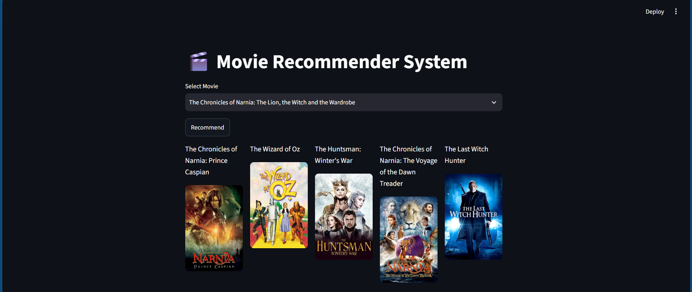
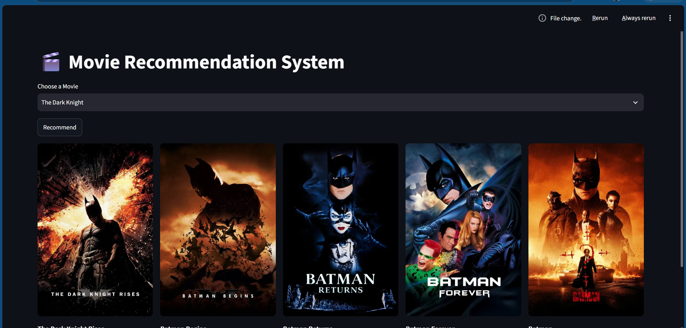

# Movie Recommendation System

A Content-Based Movie Recommendation System built using Machine Learning and Streamlit. The application recommends the top 5 movies similar to a selected movie based on movie metadata and displays their posters using the TMDB API.

---

## Preview

### Home Page



### Recommendations



---

## Features

- Recommend Top 5 similar movies
- Display movie posters using TMDB API
- Content-Based Recommendation System
- Interactive Streamlit interface
- Fast recommendations using Cosine Similarity

---

## Tech Stack

- Python
- Pandas
- NumPy
- Scikit-learn
- NLTK
- Streamlit
- Requests
- TMDB API

---

## Dataset

- TMDB 5000 Movies Dataset
- TMDB 5000 Credits Dataset

---

## Project Workflow

1. Load the movie and credits datasets.
2. Merge both datasets.
3. Perform data cleaning and preprocessing.
4. Create movie tags using genres, keywords, cast, crew, and overview.
5. Apply Porter Stemming.
6. Convert text into vectors using CountVectorizer.
7. Compute Cosine Similarity.
8. Recommend the five most similar movies.

---

## Project Structure

```
MovieRecommendationProject/
│
├── app.py
├── main.py
├── movies.pkl
├── similarity.pkl
├── tmdb_5000_movies.csv
├── tmdb_5000_credits.csv
├── requirements.txt
├── README.md
├── .gitignore
└── images/
    ├── homepage1.png
    └── homepage2.png
```

---

## Installation

Clone the repository

```bash
git clone https://github.com/your-username/MovieRecommendationProject.git
```

Move into the project directory

```bash
cd MovieRecommendationProject
```

Create a virtual environment

```bash
python -m venv .venv
```

Activate the virtual environment

**Windows**

```bash
.venv\Scripts\activate
```

Install dependencies

```bash
pip install -r requirements.txt
```

Run the application

```bash
streamlit run app.py
```

---

## Future Improvements

- Hybrid Recommendation System
- User Authentication
- Movie Trailers
- Search Suggestions
- Movie Ratings and Reviews

---

## Author

**Ritesh Kumar Mishra**

GitHub: https://github.com/your-username

LinkedIn: https://linkedin.com/in/your-linkedin

---

If you found this project useful, consider giving it a ⭐.